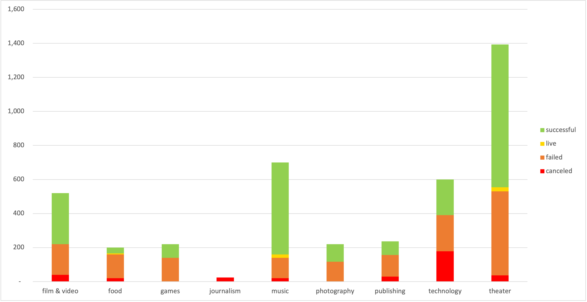
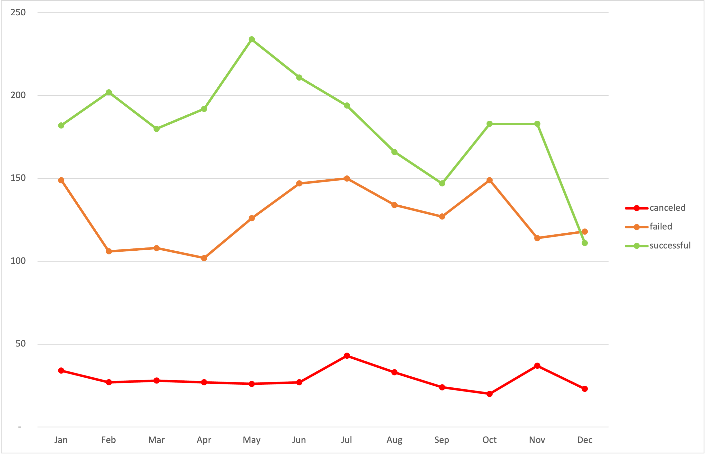

## Excel Challenge

### 1.	Given the provided data, what are three conclusions we can draw about Kickstarter  campaigns?
* Most of the projects that come to Kickstarter are for the theater category, which has a high successful rate.
* Journalism is not successful in Kickstarter. It only had 24 campaigns and none of them are successful. All of them are canceled.
* The best month to launch a campaign in Kickstarter is May. It has the higher number of success projects.

---

### 2.	What are some limitations of this dataset?
* It would be interesting to see the location of the backers to see in which country are the backers located.

---

### 3.	What are some other possible tables and/or graphs that we could create?
* I think it is important to add a table with percentage of success, failed and canceled projects by category, not just the count of projects.
* We could see how much the average donation in each category and sub-category is.

---

### 4.	Use your data to determine whether the mean or the median summarizes the data more meaningfully:
The mean is more meaningfully because the information is telling me how many backers the campaign needs on average to be successful or unsuccessful. It could help the campaign to see the probability of achievement.

---

### 5.	Use your data to determine if there is more variability with successful or unsuccessful campaigns. Does this make sense? Why or why not?
The succesful campaigns has more variability and it makes sense because the successful campaigns have an increasing amount of backers and some extremely successful campaigns can reach out to 26,457 backers.

